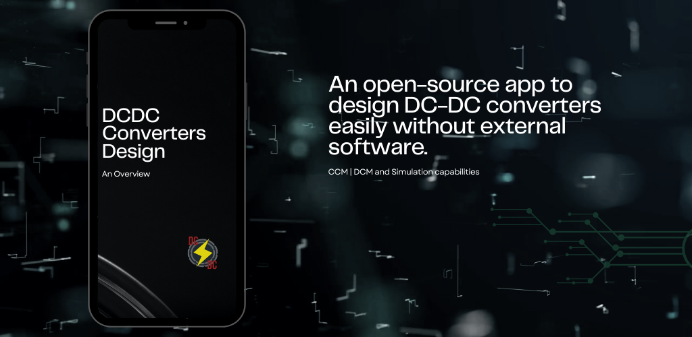

# DCDC Converters Design


[](http://bit.ly/3NWtqwQ)

<div align="center">
  <a href="#overview"><b style="color:#5c19e2;">Overview</b></a> •
  <a href="#features"><b style="color:#5c19e2;">Features</b></a> •
  <a href="#installation"><b style="color:#5c19e2;">Installation</b></a> •
  <a href="#usage"><b style="color:#5c19e2;">Usage</b></a> •
  <a href="#contributing"><b style="color:#5c19e2;">Contributing</b></a> •
  <a href="#license"><b style="color:#5c19e2;">License</b></a> •
  <a href="#contact"><b style="color:#5c19e2;">Contact</b></a>
</div>


## :camera: Overview

<!--  -->

<video width="640" height="360" controls>
  <source src="./github/official-video.mp4" type="video/mp4">
  Your browser does not support the video tag.
</video>

Watch it on [`YouTube`](https://www.youtube.com/watch?v=G9bML12c_i0).

## Features

- :ballot_box_with_check: **Easy-to-Use Interface**: The app offers a user-friendly interface that allows both beginners and experts to design DC-DC converters effortlessly.

- :ballot_box_with_check: **Multiple Converter Topologies**: Choose from the main range of DC-DC converter topologies, including Buck, Boost, Buck-Boost.

- :ballot_box_with_check: **Multiple Operation Modes**: Both Continuous Conduction and Discontinuous Conduction Modes are available.

- :ballot_box_with_check: **Component Selection**: Based on the results, select the appropriate components for your converter design, such as inductors, capacitors, diodes, and MOSFETs.

- :ballot_box_with_check: **Simulate and Analyze**: Run simulations to analyze the performance of your DC-DC converter under different conditions and loads.

- :ballot_box_with_check: **Efficiency and Loss Calculation**: Evaluate the efficiency and power loss of your converter design to optimize its performance.

- :ballot_box_with_check: **Export and Save**: Save your design configurations and simulation results for future reference or further analysis.


## Installation

1. Clone the repository: 

```bash
git clone https://github.com/leonardoacr/dcdc-converters-design.git
```

2. Open Android Studio and import the project located in the `DCDC-Converters-Design` directory.

3. Install any required dependencies using the Android Studio package manager.

4. Build and run the app on your preferred Android emulator or physical device.

Note: Make sure you have Java Development Kit (JDK) installed on your system before running the app in Android Studio.


## Usage

1. Launch the DCDC Converters Design app.
2. Choose the desired DC-DC converter topology from the available options.
3. Enter the required specifications for your design, such as input voltage, output voltage, and current ratings.
4. Select suitable components from the provided library.
5. Run simulations to analyze the performance of your DC-DC converter design.
6. Optimize the design based on efficiency and power loss calculations.
7. Save your design for future reference or export the results for further analysis.

## Contributing

This project is open source, and we welcome contributions from the community. If you have any suggestions or improvements, please feel free to:

1. Fork the repository by clicking on the "Fork" button at the top right of this page.
2. Clone the forked repository to your local machine.
3. Create a new branch for your contributions: 

```bash
git checkout -b my-contribution
```

4. Make your changes and improvements to the codebase.
5. Commit your changes: 

```bash
git commit -m "Add my contribution"
```

6. Push your changes to your forked repository: 

git push origin my-contribution

7. Open a pull request by navigating to the original repository and clicking on the "New Pull Request" button.

We will review your pull request and merge it if it aligns with the project's goals. Thank you for your contribution!

## License

This project is licensed under the MIT License.

You can copy and paste this code into a new file called README.md. Then, you can save the file in the same directory as your project files.

Once you have created the README.md file, you can open it in a text editor and customize it to fit your specific project.

Here are some additional tips for writing a good README.md file:

- Start with a brief overview of your project.
- List the features of your project.
- Provide instructions on how to build and use your project.
- Use Markdown formatting to make your README.md file more readable.
- Check your README.md file for errors before publishing it.

## Contact

If you have any questions, feedback, or inquiries regarding the DCDC Converters Design app, please don't hesitate to contact us at:

- :email: Email: dcdcconvertersproject@gmail.com

Feel free to reach out.

